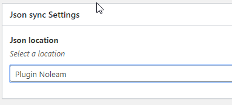
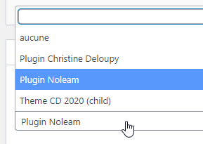

# ACF-Json-location-manager
ACF companion class to help developers to manage the json files location (plugins and/or themes) for synchronization on different platforms.

- Version 1.0

## The developer dilemma with ACF...

When a developer is developing a yheme or a plugin using ACF, he can manage (in a VCS like git or subversion) all the "Field groups" he works with.
By adding ACF JSON Sync, he's able to add the filed group description to his repo and mange it using push/pull commands.

Then, using the sync mode available in ACF backend, he can synchronized the changes on the production site.
For further information please visit
- local Json : https://www.advancedcustomfields.com/resources/local-json/
- Json Sync : https://www.advancedcustomfields.com/resources/synchronized-json/

But (there's always a but, even in a fairy tale), he can only define one json location... When developing one theme or one plugin, no problem, but when se is developing both in the same time (I always add a plugin companion for my themes), it could be a problem.
With only one JSON file, the plugin and theme group fields will be mixed in one place.
Really annoying if the developer maintains one repo for plugin, one for theme.

## My solution : ACF Json location Manager

**ACF Json location Manager** is a class that adds the possibility, for each group, to select the json file location.
 Then, thee developer can decide where he wants to put his json.

Available locations are :
- Activated plugins
- Themes (parent and/or child)

The only thing to do is to create, in the required theme of plugin, called "acf-json" and this new location will be displayed as a new choice in Json Sync metabox in group edit screen..

When those files are pushed on another platform (staging or production), it will be possible to synchronize them using the standard `ACF synchronize` way.

ACF is a great tool fot wordpress and its creator, Eliott Condon, has put a lot of hooks in the code and this tool is using some of them to achieve the job.

## How to use it ?

* Download the acf-json-location-manager.php file
* include it in your theme using `functions.php` or in your plugin.
* create an `acf-json` directory in your plugins or themes if they are not existing.

In the Field group Edition screen, you will have a new meta box used to select the associated json file 
If you want to move a json file from one location to another just select the new location in the rule...The old one will be deleted.

